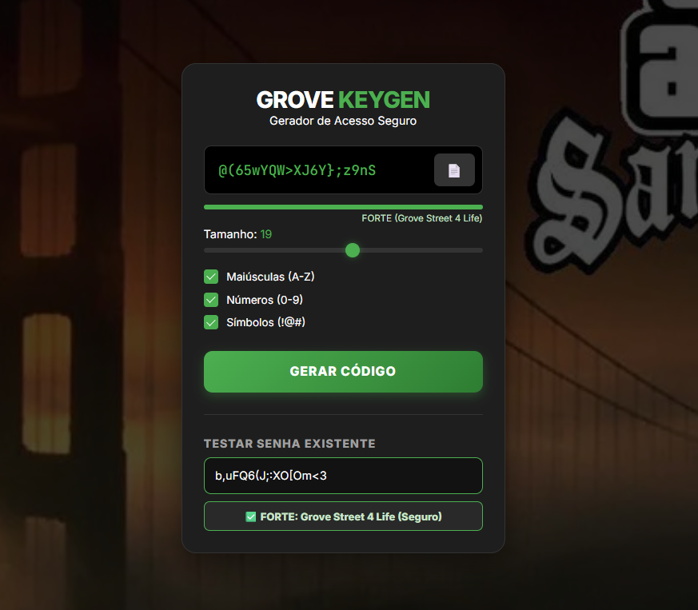

# 🔐 Grove Street KeyGen

> "You picked the wrong password, fool!"



Você pode visualizar o layout do projeto através [deste link](https://cjzinn.github.io/keygen-grove/).

## 💻 Sobre o Projeto

O **Grove Street KeyGen** é uma ferramenta de cibersegurança com uma pegada nostálgica. Ele não apenas gera senhas aleatórias criptograficamente fortes, mas também possui um **Auditor de Senhas** que avalia a segurança de credenciais existentes.

O diferencial deste projeto é a **Gamificação da Interface (UI)** baseada nas gangues rivais do jogo *GTA San Andreas*:
* 🟢 **Grove Street (Verde):** Senhas Fortes e Seguras.
* 🟣 **Ballas (Roxo):** Senhas Fracas e Vulneráveis.
* 🟠 **Vagos (Laranja):** Senhas Médias.

## ⚙️ Funcionalidades

* **🎲 Gerador Aleatório:** Cria senhas de 4 a 32 caracteres incluindo maiúsculas, números e símbolos.
* **🛡️ Auditor de Segurança:** Digite sua própria senha para verificar se ela é segura (Grove) ou perigosa (Ballas).
* **📊 Medidor Visual:** A barra de progresso e as bordas dos inputs mudam de cor dinamicamente conforme a força da senha.
* **📋 Click to Copy:** Botão rápido para copiar a senha gerada com feedback visual (Toast Notification).
* **🎨 UI Temática:** Design "Dark Mode" com background imersivo e elementos translúcidos.

## 🛠️ Tecnologias Utilizadas


## 🚀 Como testar na sua máquina

1. **Clone o repositório:**
   ```bash
   git clone https://github.com/Cjzinn/keygen-grove.git

## 🧠 Destaque do Código

A lógica de validação utiliza **Expressões Regulares (Regex)** para pontuar a senha. O sistema detecta a presença de números, símbolos e letras maiúsculas para definir a qual "Gangue" (Nível de Segurança) a senha pertence.

```javascript
// Exemplo da lógica de pontuação
function getPasswordScore(password) {
    let strength = 0;
    if (password.length >= 8) strength += 1;
    if (password.length >= 16) strength += 1;
    if (/[A-Z]/.test(password)) strength += 1; // Tem Maiúscula?
    if (/[0-9]/.test(password)) strength += 1; // Tem Número?
    if (/[^A-Za-z0-9]/.test(password)) strength += 1; // Tem Símbolo?
    return strength;
}

// Aplicação visual da temática
if (strength <= 2) {
    // Fraca (Território dos Ballas - Roxo)
    element.style.borderColor = '#9c27b0'; 
} else {
    // Forte (Grove Street - Verde)
    element.style.borderColor = '#4caf50'; 
}